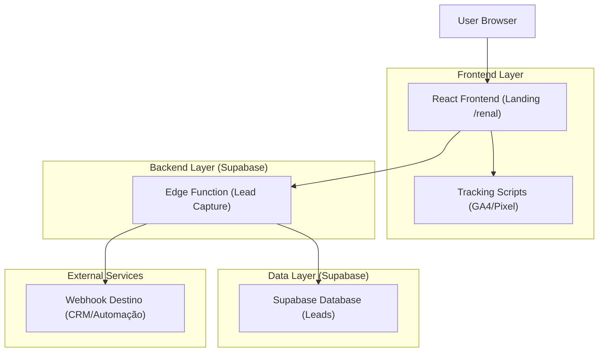
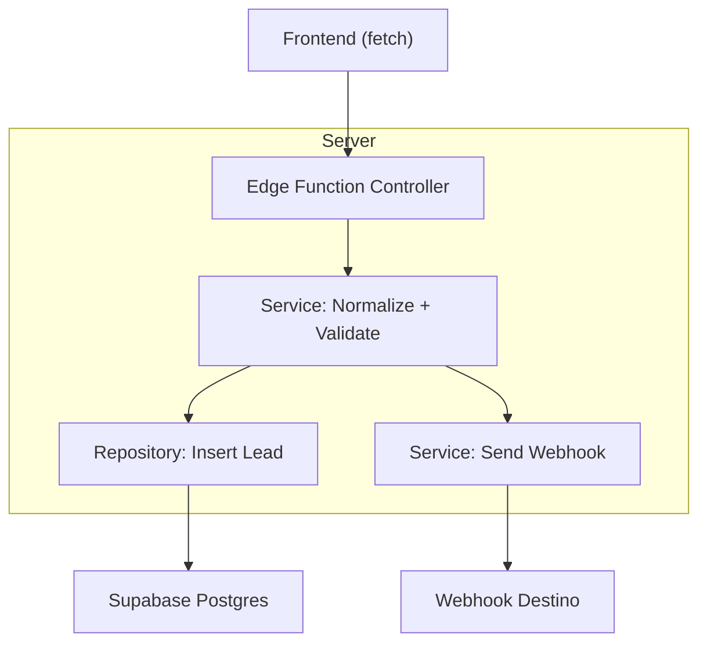
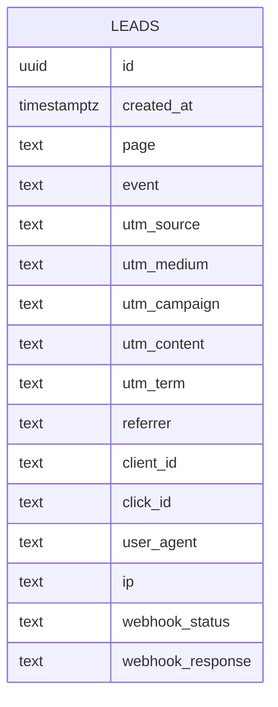

## 1.Architecture design


## 2.Technology Description
- Frontend: React@18 + vite + tailwindcss@3
- Backend: Supabase (Edge Functions)
- Database: Supabase (PostgreSQL) — tabela simples de leads (opcional, porém recomendado para auditoria e reenvio de webhook)

## 3.Route definitions
| Route | Purpose |
|---|---|
| /renal | Landing de conversão para inscrição via WhatsApp |
| /renal/obrigado | Confirmação + reforço + CTA para WhatsApp |

## 4.API definitions (If it includes backend services)
### 4.1 Core API
**Captura de lead + disparo de webhook**
```
POST /functions/v1/lead-capture
```
Request (JSON):
| Param Name | Param Type | isRequired | Description |
|---|---:|---:|---|
| page | string | true | Rota de origem (ex.: "/renal") |
| event | string | true | "view" \| "cta_click" \| "thank_you_view" |
| ts | string | true | ISO timestamp |
| utm_source | string | false | UTM |
| utm_medium | string | false | UTM |
| utm_campaign | string | false | UTM |
| utm_content | string | false | UTM |
| utm_term | string | false | UTM |
| referrer | string | false | document.referrer |
| client_id | string | false | ID do usuário (ex.: GA client id) |
| click_id | string | false | gclid/fbclid quando existir |
| whatsapp_phone | string | false | Número de destino (config) |

Response (JSON):
| Param Name | Param Type | Description |
|---|---:|---|
| ok | boolean | Status |
| lead_id | string | ID interno (uuid) |
| whatsapp_url | string | URL final do WhatsApp com mensagem pré-preenchida |

## 5.Server architecture diagram (If it includes backend services)


## 6.Data model(if applicable)
### 6.1 Data model definition


### 6.2 Data Definition Language
Leads (leads)
```
CREATE TABLE leads (
  id UUID PRIMARY KEY DEFAULT gen_random_uuid(),
  created_at TIMESTAMPTZ DEFAULT now(),
  page TEXT NOT NULL,
  event TEXT NOT NULL,
  utm_source TEXT,
  utm_medium TEXT,
  utm_campaign TEXT,
  utm_content TEXT,
  utm_term TEXT,
  referrer TEXT,
  client_id TEXT,
  click_id TEXT,
  user_agent TEXT,
  ip TEXT,
  webhook_status TEXT,
  webhook_response TEXT
);

CREATE INDEX idx_leads_created_at ON leads(created_at DESC);
CREATE INDEX idx_leads_event ON leads(event);

-- Segurança: recomendado habilitar RLS e NÃO expor leitura pública
ALTER TABLE leads ENABLE ROW LEVEL SECURITY;

-- Exemplo de grants (ajuste conforme sua política real)
GRANT SELECT ON leads TO anon;
GRANT ALL PRIVILEGES ON leads TO authenticated;
```

Notas de integração
- Webhook: manter URL/segredo somente no ambiente do Edge Function (NUNCA no frontend).
- Tracking: disparar eventos no frontend (page_view, cta_click) e, em paralelo, chamar o endpoint /lead-capture.
- SEO: garantir metatags (title/description/OG/canonical) e HTML com headings; evitar conteúdo essencial renderizado apenas via JS quando possível.