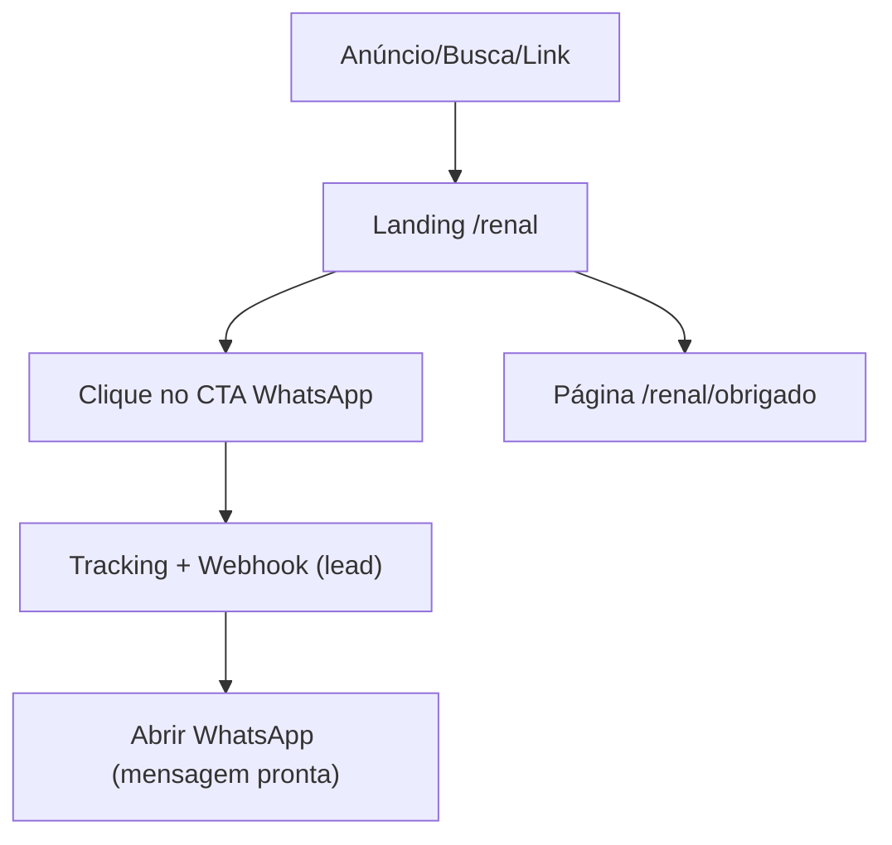

## 1. Product Overview

Landing page /renal + página de obrigado, otimizadas para converter visitantes em inscrições na aula via WhatsApp.
O foco é reduzir fricção, registrar o evento de lead (tracking/webhook) e garantir SEO básico.

## 2. Core Features

### 2.1 Feature Module

O produto consiste nas seguintes páginas:

1. **Landing “Aula Renal” (/renal)**: promessa + prova, conteúdo persuasivo, FAQ, CTAs para WhatsApp, tracking e disparo de webhook.
2. **Página de Obrigado (/renal/obrigado)**: confirmação, reforço de valor, CTA principal para WhatsApp (continuação), tracking e instruções do próximo passo.

### 2.3 Page Details

| Page Name                     | Module Name                      | Feature description                                                                                                                                                             |
| ----------------------------- | -------------------------------- | ------------------------------------------------------------------------------------------------------------------------------------------------------------------------------- |
| Landing “Aula Renal” (/renal) | SEO e metadados                  | Definir title/description/canonical/OG; incluir headings (H1/H2) coerentes; incluir conteúdo indexável e links internos mínimos (políticas/termos se existirem).                |
| Landing “Aula Renal” (/renal) | Hero de conversão                | Apresentar promessa clara (headline + subheadline); destacar para quem é; exibir CTA principal “Quero me inscrever no WhatsApp”; mostrar microcopy de privacidade/sem spam.     |
| Landing “Aula Renal” (/renal) | Seções persuasivas               | Explicar problema → mecanismo/solução → o que você vai aprender; listar benefícios em bullets; apresentar “pra quem é / pra quem não é”.                                        |
| Landing “Aula Renal” (/renal) | Prova e credibilidade            | Exibir credenciais (ex.: profissional, experiência) e/ou depoimentos/provas disponíveis; incluir elementos de confiança (selos, imprensa, números) apenas se existirem.         |
| Landing “Aula Renal” (/renal) | FAQ (redução de objeções)        | Responder dúvidas-chave (duração, para quem serve, custo, como acessar, privacidade no WhatsApp); permitir expandir/recolher.                                                   |
| Landing “Aula Renal” (/renal) | CTA persistente                  | Exibir CTA no topo e repetido ao longo da página; opcional barra fixa no rodapé com CTA (desktop-first).                                                                        |
| Landing “Aula Renal” (/renal) | Integrações (tracking + webhook) | Capturar UTMs/referrer/ID de click; disparar evento de “view” e “cta\_click”; enviar payload para endpoint de webhook/lead; abrir link do WhatsApp com mensagem pré-preenchida. |
| Obrigado (/renal/obrigado)    | Confirmação e próximos passos    | Confirmar ação; explicar claramente “1) clique no WhatsApp 2) envie a mensagem pronta 3) você recebe instruções”; reduzir ansiedade com expectativa.                            |
| Obrigado (/renal/obrigado)    | CTA WhatsApp (principal)         | Repetir CTA para WhatsApp com mensagem pré-preenchida; exibir alternativa “copiar mensagem” caso o app não abra.                                                                |
| Obrigado (/renal/obrigado)    | Integrações (tracking + webhook) | Disparar evento de “thank\_you\_view”; reforçar envio de lead se ainda não enviado; registrar status de redirecionamento para WhatsApp (sucesso/falha).                         |

## 3. Core Process

**Fluxo do visitante (principal)**

1. Você entra na /renal (por anúncio, busca ou link). 2) A página lê UTMs/referrer e registra “view”. 3) Você clica em “Quero me inscrever no WhatsApp”. 4) Antes de abrir o WhatsApp, o site registra o clique (tracking) e envia um lead via webhook. 5) Você cai no WhatsApp com uma mensagem pronta para enviar. 6) Opcionalmente, você acessa /renal/obrigado (após retorno/redirect do próprio site) para reforço e novo CTA.

